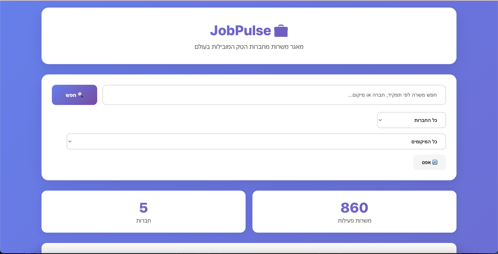

**Live Demo:** https://app.myjobplace.app  
*(This copy is for portfolio review — clean structure, no heavy setup required.)*


> **Note:** UI is in Hebrew. API docs: `/docs` and `/redoc` on the live server.

<sub>Replace `docs/screenshot.png` with an actual screenshot of the live site.</sub>
- FastAPI backend with tidy `src/` layout
- Health endpoints: `/health`, `/readyz`
- Jobs endpoints: list / create / update / count + filters & pagination
- Alembic migrations and a focused test suite
| Method | Path            | Description                  |
|-------:|-----------------|------------------------------|
| GET    | `/health`     | Liveness check               |
| GET    | `/readyz`     | Readiness check              |
| GET    | `/jobs/`      | List jobs (filters/paging)   |
| POST   | `/jobs/`      | Create a job                 |
| GET    | `/jobs/{id}`  | Get a job                    |
| PUT    | `/jobs/{id}`  | Update a job                 |
| GET    | `/jobs/count` | Count with filters           |
> Optional local try:
> ```bash
> pip install -r requirements.txt
> uvicorn jobpulse_api.main:app --app-dir src --host 127.0.0.1 --port 8010
> # open http://127.0.0.1:8010/health
> ```
